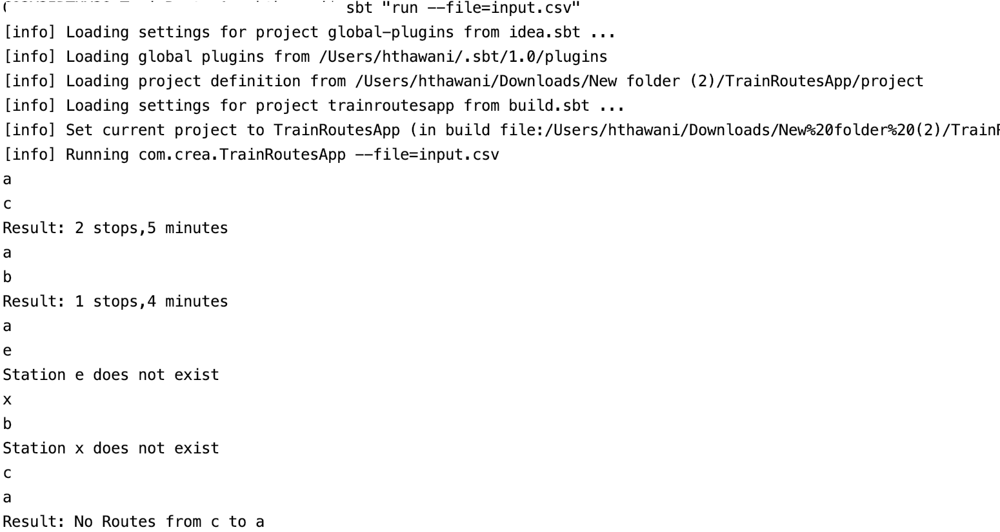
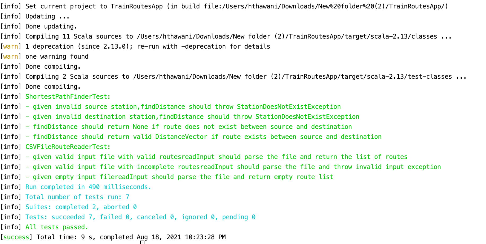

CREA Train Route APP
==========================

This Repository contains solution to CREA's Train Route Assignment.
To run this app you will need to setup Scala 2.13 on your machine.

Running APP
----------
Execute Below Command in terminal

```sbt "run --file=input.csv"```

Then it will wait for prompt,add source and destination stations just like example mentioned in pdf.

This is how output will look like



Running Tests
----------
Execute Below Command in terminal

```sbt test```

This is how overall test summary will look like.



Todo
----------
- Improve Readme 
    - add info to setup Scala and SBT
    - add flow diagram
- add scala formatter
- Add loggers
- Add in-memory cache to cache requests
- Add asynchronus support to serve requests
- Integrate Sonar Plugin for code quality
- Generate Test coverage report
- Setup Application Monitoring
- Send Measurement message to monitor usage and performance
- setup load tests

 